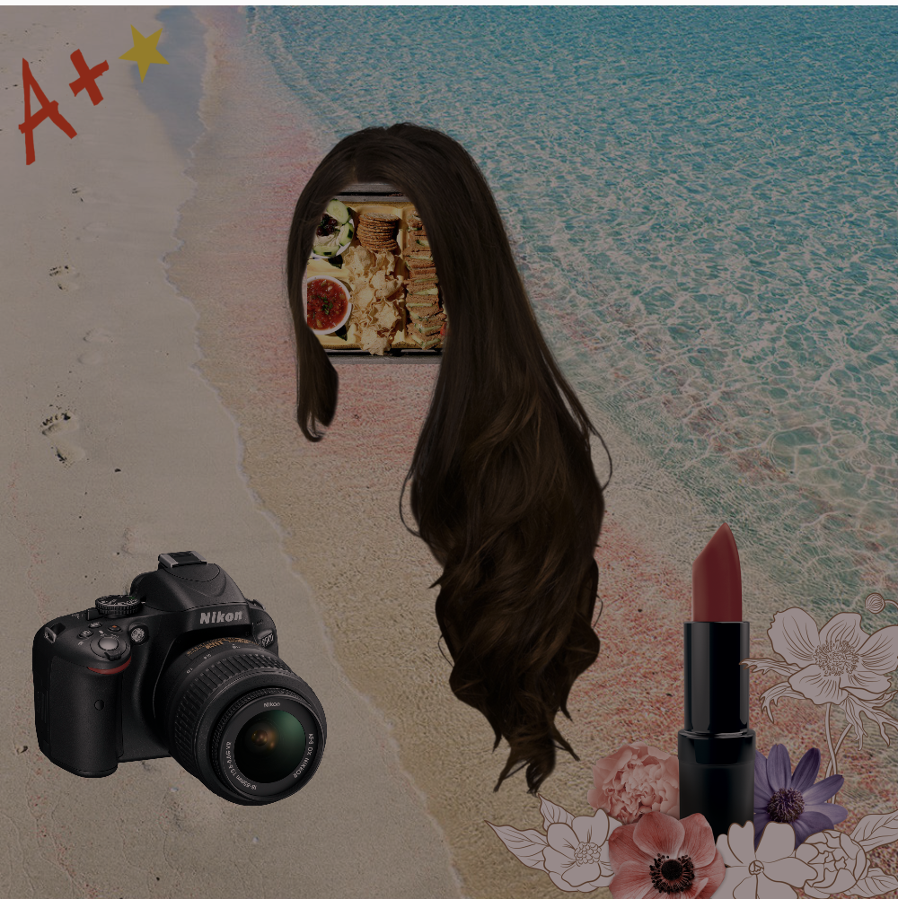

# Mini-Project: Vision Board

Vision boards are used to set intentions around what people want their life to look like in the future

**GOAL**: Create a vision board collage full of things you'd like to bring into your life. 

## Project Requirements
Your final vision board should:

1. Contain at least 6 images that represent goals for your life.
2. Render images using `preload`, `loadImage`, and `image` functions.
3. Use `tint` to alter the appearance of some or all of the images. Feel free to add sliders to let the user adjust your vision boards style!

If you finish early, try one or all of these extensions!

- Make something change or appear when the mouse hovers over a certain area, when the mouse is clicked, or when a button is pressed.
- When an object is clicked or hovered on, display a message or reminder about how to achieve that dream.
- Make an element of your vision board vary each time to program is run, or change based on key presses or clicks.
- Use a for loop to draw an image repeatedly

